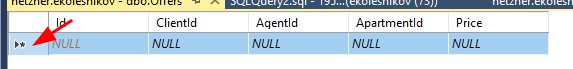

# GITHUB.COM/KOLEI/DT

# Шпаргалка для демо-экзамена

**Содержимое репозитория**

* в каталоге `data` лежат файлы для импорта
* в каталоге `articles` лежат шпаргалки для демо-экзамена

**Темы**

* [День 1: импорт данных в БД](#День-1)
* [День 2: программирование, отображение списка в табличном виде](#День-2)
* [День 3: программирование, сортировка, фильтрация](#День-3)
* [День 4: тестирование, создание библиотеки классов, создание тестирующего проекта, написание UNIT-тестов](#День-4)

## День 1

**Введение в предметную область**

В рамках данного задания вам предстоит реализовать систему, упрощающую работу риэлтора. 

**Риэлтор** - сотрудник компании агентства недвижимости. Выступает в качестве посредника между клиентом и компанией. 

**Клиент** - человек, который желает купить либо продать объект недвижимости.

**Объект недвижимости** - недвижимое имущество, предмет сделки
между клиентами.

**Потребность** - желание клиента купить объект недвижимости, соответствующего указанным параметрам.

**Предложение** - желание клиента продать указанный объект недвижимости за указанную цену.

**Сделка** - факт осуществления продажи недвижимого имущества. В сделке участвуют две стороны: клиент-покупатель с потребностью и клиент-продавец с предложением.

**Стоимость услуг или комиссия** - количество денег, которое должен заплатить клиент за оказанные ему компанией услуги.

**Задание**

Если в ресурсах есть готовая структура БД (скрипт *.sql), то создать из неё:

* в контекстном меню вашей БД выбираете пункт "создать запрос"
* копируйте в редактор запроса текст скрипта (выбор базы можно убрать, вы уже в ней)
* выполняете запрос - в БД должны появиться таблицы

Если нет, то создать таблицы по [шаблону](./articles/sql.md)

Синтаксис запроса создания таблицы:


```
CREATE TABLE НазваниеТаблицы 
```

Затем в скобках перечисляются поля в формате:

```
НазваниеПоля ТипДанных [NOT NULL],
```

Основные типы данных приведены в шпаргалке, там же есть пример запроса для создания таблицы *Clients*

`[NOT NULL]` - квадратные скобки обозначают что эта часть не обязательна, `NOT NULL` указывается для ОБЯЗАТЕЛЬНЫХ полей


1. Импортировать данные о клиентах: `data/clients.csv`

    **Поля**: *фамилия*, *имя*, *отчество*, *номер телефона*, *электронная почта*.

    Любое из полей: фамилия, имя, отчество - может отсутствовать, равно как и все сразу. Поля номер телефона и электронная почта не обязательны к заполнению, но одно из них должно быть указано.

    Раньше я вас учил делать импорт через SQL-запросы, но *Management Studio* "умеет" вставлять данные в таблицу через буфер обмена:

    1. Подготовьте данные для импорта: откройте таблицу Excel (импортируйте, если нужно из txt или csv); убедитесь, что порядок, количество столбцов и ТИП ДАННЫХ в них соответвуют таблице, в которую вы собираетесть импортировать данные.
    2. В контекстном меню **название таблицы** выбираете *изменить первые 200 строк*
    3. В таблице Excel выделяете данные для импорта (без заголовков) и копируете в буфер обмена
    4. В таблице *Management Studio* выделяете строку (кликнув по колонке слева) и вставляете данные из буфера обмена

        

2. Импортировать данные об агентах: `data/agents.csv`

    Поля: фамилия, имя, отчество, доля от комиссии.

    У риэлторов поля ФИО обязательны к заполнению. Доля от комиссии - необязательное числовое поле, может принимать значение от 0 до 100.

    Импорт данных по аналогии с п.1

3. Импортировать данные об объектах недвижимости: `data/apartments.csv`

    У каждого объекта недвижимости есть два необязательных к заполнению поля: адрес и координаты.

    Дополнительные поля: этаж, количество комнат, площадь.
    
    Все поля являются необязательными к заполнению.

    Адрес объекта недвижимости состоит из четырех необязательных к заполнению полей: город, улица, номер дома, номер квартиры.  Все они являются строковыми типами.

    Координаты объекта недвижимости - это географические координаты, пара вещественных значений: широта, долгота. Широта может принимать значения от -90 до +90, долгота - от -180 до +180.

    **ВНИМАНИЕ!!!**

    По данным видно, что поля город и улица должны быть словарными

    ```
    Id,Address_City,Address_Street,Address_House,Address_Number,Coordinate_latitude,Coordinate_longitude,TotalArea,Rooms,Floor
    1,Тюмень,Энергостроителей,25,12,0,0,41.7,1,3
    2,Тюмень,Елизарова,8,44,0,0,105,3,5
    3,Тюмень,Московский тракт,139,6,0,0,62,3,2
    ```

    Это значит, что вместо названий города и улицы в таблице должны быть внешние ключи для таблиц "Города" и "Улицы".

    Скрипт для создания таблицы **Apartments** напишите сами по [образцу](./articles/sql.md) таблицы Offers, но перед этим нужно создать таблицы "Города" (Cities) и "Улицы" (Streets).

    ```sql
    CREATE TABLE Cities (
        Id int IDENTITY(1,1) NOT NULL, 
            CONSTRAINT PK_Cities_Id PRIMARY KEY (Id),
        [Name] nvarchar(100)
    )
    ```

    И загрузить данные из буфера обмена тут уже не получится.

    Импорт данных в такие таблицы делаем в 3 этапа:

    1. Делаем импорт данных с созданием временной таблицы, например `apartment_a_import`

    2. Заполняем словари. Например, для городов это будет примерно так (вставляем все уникальные значения из временной таблицы):

        ```sql
        insert into Cities ([Name]) 
            select distinct Address_City from apartment_a_import
        ```

        Для улиц напишите сами.

    3. И переносим данные в основную таблицу `Apartments` с учетом словарей:

        ```sql
        INSERT INTO Apartments (AddressCityId, AddressStreetId, AddressHouse, AddressNumber,... дельше мне лень писать )
            SELECT c.id, s.id, ai.Address_House,... дальше тоже лень
            FROM apartment_a_import ai, 
                Cities c,
                Streets s
            WHERE c.[Name]=ai.Address_City AND s.Name=ai.Address_Street
        ```

4. Создать таблицу "Предложения" (Offers). Поля: клиент, риэлтор, объект недвижимости, цена. Все поля являются обязательными. Цена - целое положительное число. Клиент, риэлтор, объект недвижимости - ссылки на сущности соответствующих типов. Пример есть в `sql.md`

5. Создать таблицу "Потребности" (Needs). Поля: клиент, риэлтор, адрес, мин цена, максимальная цена. Поля клиент, риэлтор являются обязательными к заполнению. Клиент, риэлтор - ссылки на сущности соответствующих типов.  Минимальная цена, максимальная цена - целые положительные числа. Запрос напишите сами.

## День 2

1. Создать WPF-проект, добавить логотип, иконку

    Последнее время стало популярно втыкать авторизацию (ввод логина/пароля и их проверка) в проекты. В простом оконном приложении "красиво" реализовать это не просто, на будущее я буду давать работу с фреймами и страницами, а пока можно сделать такую вёрстку: 

    ```xml
            Name="Root">
            <!-- окну даем имя -->
        <Grid>
            <!-- создаем две колонки с шириной "auto" -->
            <Grid.ColumnDefinitions>
                <ColumnDefinition Width="auto"/>
                <ColumnDefinition Width="auto"/>
            </Grid.ColumnDefinitions>

            <!-- и создаем два грида, один для верстки формы с логином/паролем -->
            <Grid 
                Visibility="Visible"
                x:Name="PasswordGrid"
                Width="{Binding ElementName=Root, Path=Width}">
                <!-- ширину гридов привязываем к ширине окна -->
                <StackPanel 
                    Orientation="Vertical"
                    VerticalAlignment="Center">
                    <Label Content="Введите логин"/>
                    <TextBox Name="LoginBox"/>
                    <Label Content="Введите пароль"/>
                    <PasswordBox x:Name="PasswordBox"/>
                    <Button 
                        x:Name="LoginButton" 
                        Click="LoginButton_Click" 
                        Content="ОК"/>
                </StackPanel>
            </Grid>

            <!-- второй для основной верстки, он пока скрыт: Visibility="Collapsed"  -->
            <Grid
                x:Name="ContentGrid"
                Grid.Column="1"
                Visibility="Collapsed"  
                Width="{Binding ElementName=Root, Path=Width}">

                <Button Content="Logout" Click="LoginButton_Click"/>

            </Grid>
        </Grid>
    </Window>
    ```

    И в коде делаем переключение между гридами:

    ```cs
    public partial class MainWindow : Window, INotifyPropertyChanged
    {
        public event PropertyChangedEventHandler PropertyChanged;
    
        private bool _PasswordVisibility = true;

        private bool PasswordVisibility {
            get {
                return _PasswordVisibility;
            }
            set {
                _PasswordVisibility = value;
                PasswordGrid.Visibility = PasswordVisibility ? Visibility.Visible : Visibility.Collapsed;
                ContentGrid.Visibility = PasswordVisibility ? Visibility.Collapsed : Visibility.Visible;
                if (PropertyChanged != null)
                {
                    // обновляем не каждое поле по отдельности, а все окно
                    PropertyChanged(this, new PropertyChangedEventArgs("Root"));
                }
            }
        }

        public MainWindow()
        {
            InitializeComponent();
            PasswordVisibility = true;
            DataContext = this;
        }

        private void LoginButton_Click(object sender, RoutedEventArgs e)
        {
            // тут нужно конечно навернуть проверку логина и пароля
            PasswordVisibility = !PasswordVisibility;
        }

        ...
    ```

2. Вывод, редактирование, создание, удаление (CRUD) объектов недвижимости (тут есть поля с внешними ключами)

    Список я сделал отдельным окном, потому что в нашей задаче пока не просматривается главная таблица.


    Замечания по разметке окна:

    ```xml
    <Grid>
        <Grid.ColumnDefinitions>
            <ColumnDefinition Width="150"/>
            <ColumnDefinition Width="*"/>
        </Grid.ColumnDefinitions>

        <Grid Grid.Column="1">
            <Grid.RowDefinitions>
                <!-- grid поддерживает автоматическую высоту (и ширину) ячейки - по содержимому -->
                <RowDefinition Height="auto"/>
                <RowDefinition Height="*"/>
            </Grid.RowDefinitions>

            <!-- WrapPanel переносит вложенные элементы на следующую строку (колонку)  -->
            <WrapPanel
                ItemHeight="40px">
                <Button Content="button1"/>
            </WrapPanel>
            <DataGrid Grid.Row="1"/>
        </Grid>
    </Grid>
    ```

    **Объекты недвижимости (Apartments)**

    У каждого объекта недвижимости есть поля: адрес и координаты.

    Дополнительные поля: этаж, количество комнат, площадь.

    Дополнительные поля являются необязательными к заполнению.

    Адрес объекта недвижимости состоит из четырех полей: город, улица, номер дома, номер квартиры.

    Координаты объекта недвижимости - это географические координаты, пара вещественных значений: широта, долгота. Широта может принимать значения от -90 до +90, долгота - от -180 до +180.

    Интерфейс должен не позволять пользователю удалять объект недвижимости, связанный с предложением.

    Добавьте возможность фильтрации объектов недвижимости по типу, адресу.


    1. DataGrid (список объектов недвижимости)

        В окне создаем свойство *ApartmentsList* для списка и заполняем его в конструкторе

        ```cs
        private IEnumerable<Apartments> _ApartmentsList;

        public IEnumerable<Apartments> ApartmentsList
        {
            get
            {
                return _ApartmentsList;
            }
            set
            {
                _ApartmentsList = value;
                // при изменении списка перерисуется DataGrid
                if (PropertyChanged != null)
                {
                    PropertyChanged(this, new PropertyChangedEventArgs("ApartmentsList"));
                }
            }
        }

        public ApartmentsListWindow()
        {
            InitializeComponent();
            DataContext = this;
            ApartmentsList = Core.DB.Apartments.ToArray();
        }
        ```

        В разметке добавляем и настраиваем DataGrid для этого списка

        ```xml
        <DataGrid
            x:Name="ApartmentsDataGrid"
            Grid.Row="1"
            CanUserAddRows="false"
            AutoGenerateColumns="False"
            ItemsSource="{Binding ApartmentsList}">

            <DataGrid.Columns>
                <DataGridTextColumn
                    Width="100"
                    Header="Город"
                    Binding="{Binding Cities.Name}"/>
                <!-- Entity создает для нас виртуальные свойства Cities и Streets, 
                через которые можем получить название города и улицы соответственно -->
                <DataGridTextColumn
                    Width="100"
                    Header="Улица"
                    Binding="{Binding Streets.Name}"/>
                <DataGridTextColumn
                    Width="50"
                    Header="Дом"
                    Binding="{Binding House}"/>
                <DataGridTextColumn
                    Width="70"
                    Header="Квартира"
                    Binding="{Binding Number}"/>
                <DataGridTextColumn
                    Width="70"
                    Header="Площадь"
                    Binding="{Binding TotalArea}"/>
                <DataGridTextColumn
                    Width="120"
                    Header="Количество комнат"
                    Binding="{Binding Rooms}"/>
                <DataGridTextColumn
                    Width="50"
                    Header="Этаж"
                    Binding="{Binding Floor}"/>
                <DataGridTemplateColumn
                    Header="Действия">
                    <DataGridTemplateColumn.CellTemplate>
                        <DataTemplate>
                            <StackPanel 
                                Orientation="Horizontal">
                                <Button 
                                    Content="Редактировать" 
                                    Name="EditButton" 
                                    Click="EditButton_Click"/>
                                <Button 
                                    Content="Удалить" 
                                    Name="DeleteButton" 
                                    Click="DeleteButton_Click"/>
                            </StackPanel>
                        </DataTemplate>
                    </DataGridTemplateColumn.CellTemplate>
                </DataGridTemplateColumn>
            </DataGrid.Columns>
        </DataGrid>
        ```

        **Удаление объекта недвижимости**

        ```cs
        private void DeleteButton_Click(object sender, RoutedEventArgs e)
        {
            var Apartment = ApartmentsDataGrid.SelectedItem as Apartments;
            // если объект недвижимости учавствует в каких-то предложениях, 
            // список предложений буде не пустой (магия внешних ключей)
            if (Apartment.Offers.Count > 0)
            {
                MessageBox.Show("Нельзя удалять объект недвижимости, на который есть предложение");
                return;
            }

            // процесс удаления заворачиваем в try..catch
            try
            {
                Core.DB.Apartments.Remove(Apartment);
                Core.DB.SaveChanges();
                ApartmentsList = Core.DB.Apartments.ToArray();
            }
            catch (Exception ex)
            {
                MessageBox.Show($"Ошибка при удалении объекта недвижимости: {ex.Message}");
            }
        }
        ```

        **Редактрование/добавление объекта недвижимости**   

        1. Создаем отдельное окно 

            В конструкторе окна передаем ссылку на текущий объект недвижимости и считываем справочники улиц и городов:

            ```cs
            public Apartments CurrentApartment { get; set; }
            public IEnumerable<Cities> CitiesList { get; set; }
            public IEnumerable<Streets> StreetsList { get; set; }

            public ApartmentWindow(Apartments Apartment)
            {
                InitializeComponent();
                DataContext = this;
                CurrentApartment = Apartment;
                CitiesList = Core.DB.Cities.ToArray();
                StreetsList = Core.DB.Streets.ToArray();
            }
            ```

        2. В разметке рисуем все поля (кроме Id)

            ```xml
            <Grid>
                <StackPanel
                    Margin="10"
                    Orientation="Vertical">

                    <Label Content="Город"/>
                    <!-- для справочных полей выводим выпадающие списки
                    выбранным элементом которых является значение виртуального свойства Cities и Streets -->
                    <ComboBox
                        ItemsSource="{Binding CitiesList}"
                        SelectedItem="{Binding CurrentApartment.Cities}">
                        <ComboBox.ItemTemplate>
                            <DataTemplate>
                                <Label Content="{Binding Name}"/>
                            </DataTemplate>
                        </ComboBox.ItemTemplate>
                    </ComboBox>
                    <Label Content="Улица"/>
                    <ComboBox
                        ItemsSource="{Binding StreetsList}"
                        SelectedItem="{Binding CurrentApartment.Streets}">
                        <ComboBox.ItemTemplate>
                            <DataTemplate>
                                <Label Content="{Binding Name}"/>
                            </DataTemplate>
                        </ComboBox.ItemTemplate>
                    </ComboBox>
                    <Label Content="Дом"/>
                    <TextBox Text="{Binding CurrentApartment.House}"/>

                    <!-- тут мне опять лень писать, остальные поля простые, заполнить по образу "дома" -->

                    <Button x:Name="SaveButton" Content="Сохранить" Click="SaveButton_Click"/>
                </StackPanel>
            </Grid>
            ```

        3. По нажатию кнопки сохранить проверяем обязательные поля (я не сделал, но надо еще проверить что сумма положительная)

            ```cs
            private void SaveButton_Click(object sender, RoutedEventArgs e)
            {
                // опять же всю работу с БД заворачиваем в try..catch
                try
                {
                    if (CurrentApartment.Cities == null)
                        throw new Exception("Не выбран город");

                    if (CurrentApartment.Streets == null)
                        throw new Exception("Не выбрана улица");

                    if (CurrentApartment.Id == 0)
                        Core.DB.Apartments.Add(CurrentApartment);

                    Core.DB.SaveChanges();
                    DialogResult = true;
                }
                catch (Exception ex)
                {
                    MessageBox.Show($"Ошибка: {ex.Message}");
                }
            }
            ```

        4. И в списке объектов недвижимости на кнопки добавить/редактировать повесить обработчики

            ```cs
            private void AddButton_Click(object sender, RoutedEventArgs e)
            {
                var NewApartmentWindow = new ApartmentWindow(new Apartments());
                if (NewApartmentWindow.ShowDialog() == true)
                {
                    ApartmentsList = Core.DB.Apartments.ToArray();
                }
            }

            private void EditButton_Click(object sender, RoutedEventArgs e)
            {
                var EditApartmentWindow = new ApartmentWindow(ApartmentsDataGrid.SelectedItem as Apartments);
                if (EditApartmentWindow.ShowDialog() == true)
                {
                    ApartmentsList = Core.DB.Apartments.ToArray();
                }
            }
            ```

    Реализовать CRUD для Клиентов, Агентов и Предложений

<!-- 2. Подключиться к созданной БД
3. Реализовать просмотр, создание, редактирование и удаление клиентов и агентов

    **Клиент**

    Поля: фамилия, имя, отчество, номер телефона, электронная почта.

    Любое из полей: фамилия, имя, отчество - может отсутствовать, равно как и все сразу. Поля номер телефона и электронная почта не обязательны к заполнению, но одно из них должно быть указано.

    Реализуйте интерфейс, который позволит пользователю осуществлять операции создания нового клиента, обновления информации о клиенте, удаления клиента.

    Интерфейс должен не позволять пользователю создать клиента без указания номера телефона или электронной почты, удалять клиента, связанного с потребностью или предложением.

    **Риэлтор**

    Поля: фамилия, имя, отчество, доля от комиссии.

    У риэлторов поля ФИО обязательны к заполнению. Доля от комиссии - необязательное числовое поле, может принимать значение от 0 до 100.

    Реализуйте интерфейс, который позволит пользователю осуществлять операции создания нового риэлтора, обновления информации о риэлторе, удаления риэлтора.

    Интерфейс должен не позволять пользователю создать риэлтора без указания фамилии, имени и отчества, удалять риэлтора, связанного с потребностью или предложением.

 -->
