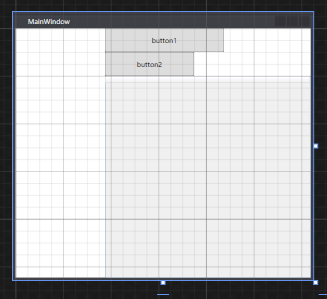

# GITHUB.COM/KOLEI/DT

# Шпаргалка для демо-экзамена

**Содержимое репозитория**

* в каталоге `data` лежат файлы для импорта
* в каталоге `articles` лежат шпаргалки для демо-экзамена

**Темы**

* [День 1: импорт данных в БД](#День-1)
* [День 2: программирование, отображение списка в табличном виде](#День-2)
* [День 3: программирование, сортировка, фильтрация](#День-3)
* [День 4: тестирование, создание библиотеки классов, создание тестирующего проекта, написание UNIT-тестов](#День-4)

## День 1

**Введение в предметную область**

В рамках данного задания вам предстоит реализовать систему, упрощающую работу риэлтора. 

**Риэлтор** - сотрудник компании агентства недвижимости. Выступает в качестве посредника между клиентом и компанией. 

**Клиент** - человек, который желает купить либо продать объект недвижимости.

**Объект недвижимости** - недвижимое имущество, предмет сделки
между клиентами.

**Потребность** - желание клиента купить объект недвижимости, соответствующего указанным параметрам.

**Предложение** - желание клиента продать указанный объект недвижимости за указанную цену.

**Сделка** - факт осуществления продажи недвижимого имущества. В сделке участвуют две стороны: клиент-покупатель с потребностью и клиент-продавец с предложением.

**Стоимость услуг или комиссия** - количество денег, которое должен заплатить клиент за оказанные ему компанией услуги.

**Задание**

Если в ресурсах есть готовая структура БД (скрипт *.sql), то создать из неё:

* в контекстном меню вашей БД выбираете пункт "создать запрос"
* копируйте в редактор запроса текст скрипта (выбор базы можно убрать, вы уже в ней)
* выполняете запрос - в БД должны появиться таблицы

Если нет, то создать таблицы по [шаблону](./articles/sql.md)

1. Импортировать данные о клиентах: `data/clients.csv`

    **Поля**: *фамилия*, *имя*, *отчество*, *номер телефона*, *электронная почта*.

    Любое из полей: фамилия, имя, отчество - может отсутствовать, равно как и все сразу. Поля номер телефона и электронная почта не обязательны к заполнению, но одно из них должно быть указано.

    Раньше я вас учил делать импорт через SQL-запросы, но *Management Studio* "умеет" вставлять данные в таблицу через буфер обмена:

    1. Подготовьте данные для импорта: откройте таблицу Excel (импортируйте, если нужно из txt или csv); убедитесь, что порядок и количество столбцов соответвуют таблице, в которую вы собираетесть импортировать данные
    2. В контекстном меню **название таблицы** выбираете *изменить первые 200 строк*
    3. В таблице Excel выделяете данные для импорта (без заголовков) и копируете в буфер обмена
    4. В таблице *Management Studio* выделяете строку (кликнув по колонке слева) и вставляете данные из буфера обмена

        

2. Импортировать данные об агентах: `data/agents.csv`

    Поля: фамилия, имя, отчество, доля от комиссии.

    У риэлторов поля ФИО обязательны к заполнению. Доля от комиссии - необязательное числовое поле, может принимать значение от 0 до 100.

3. Импортировать данные об объектах недвижимости: `data/apartments.csv`

    У каждого объекта недвижимости есть два необязательных к заполнению поля: адрес и координаты.

    Дополнительные поля: этаж, количество комнат, площадь.
    
    Все поля являются необязательными к заполнению.

    Адрес объекта недвижимости состоит из четырех необязательных к заполнению полей: город, улица, номер дома, номер квартиры.  Все они являются строковыми типами.

    Координаты объекта недвижимости - это географические координаты, пара вещественных значений: широта, долгота. Широта может принимать значения от -90 до +90, долгота - от -180 до +180.

    **ВНИМАНИЕ!!!**

    По данным видно, что поля город и улица должны быть словарными

    ```
    Id,Address_City,Address_Street,Address_House,Address_Number,Coordinate_latitude,Coordinate_longitude,TotalArea,Rooms,Floor
    1,Тюмень,Энергостроителей,25,12,0,0,41.7,1,3
    2,Тюмень,Елизарова,8,44,0,0,105,3,5
    3,Тюмень,Московский тракт,139,6,0,0,62,3,2
    ```

    Это значит, что вместо названий города и улицы в таблице должны быть внешние ключи для таблиц "Города" и "Улицы".

    Скрипт для создания таблицы **Apartments** вы напишите сами по [образцу](./articles/sql.md), но перед этим нужно создать таблицы "Города" (Cities) и "Улицы" (Streets).

    ```sql
    CREATE TABLE Cities (
        Id int IDENTITY(1,1) NOT NULL, 
            CONSTRAINT PK_Cities_Id PRIMARY KEY (Id),
        [Name] nvarchar(100)
    )
    ```

    И загрузить данные из буфера обмена уже не получится.

    Импорт данных в такие таблицы делаем в 3 этапа:

    1. Делаем импорт данных с созданием временной таблицы, например `apartment_a_import`

    2. Заполняем словари. Например, для городов это будет примерно так (вставляем все уникальные значения из временной таблицы):

    ```sql
    insert into Cities ([Name]) 
        select distinct Address_City from apartment_a_import
    ```

    3. И переносим данные в основную таблицу `Apartments` с учетом словарей:

    ```sql
    INSERT INTO Apartments (AddressCityId, AddressStreetId, AddressHouse, AddressNumber,... дельше мне лень писать )
        SELECT s.id, st.id, ai.Address_House,... дальше тоже лень
        FROM apartment_a_import ai, 
             Sities s,
             Streets st
        WHERE s.[Name]=ai.Address_City AND st.Name=ai.Address_Street
    ```

4. Создать таблицу "Предложение". Поля: клиент, риэлтор, объект недвижимости, цена. Все поля являются обязательными. Цена - целое положительное число. Клиент, риэлтор, объект недвижимости - ссылки на сущности соответствующих типов.

5. Создать таблицу "Потребность". Поля: клиент, риэлтор, адрес, мин цена, максимальная цена. Поля клиент, риэлтор являются обязательными к заполнению. Клиент, риэлтор - ссылки на сущности соответствующих типов.  Минимальная цена, максимальная цена - целые положительные числа.

## День 2

1. Создать WPF-проект, добавить логотип, иконку

    Замечания по разметке

    ```xml
    <Grid>
        <Grid.ColumnDefinitions>
            <ColumnDefinition Width="150"/>
            <ColumnDefinition Width="*"/>
        </Grid.ColumnDefinitions>

        <Grid Grid.Column="1">
            <Grid.RowDefinitions>
                <!-- grid поддерживает автоматическую высоту (и ширину) ячейки - по содержимому -->
                <RowDefinition Height="auto"/>
                <RowDefinition Height="*"/>
            </Grid.RowDefinitions>

            <!-- WrapPanel переносит вложенные элементы на следующую строку (колонку)  -->
            <WrapPanel
                ItemHeight="40px">
                <Button Content="button1"/>
            </WrapPanel>
            <DataGrid Grid.Row="1"/>
        </Grid>
    </Grid>
    ```

    

2. Подключиться к созданной БД
3. Реализовать просмотр, создание, редактирование и удаление клиентов и агентов

    **Клиент**

    Поля: фамилия, имя, отчество, номер телефона, электронная почта.

    Любое из полей: фамилия, имя, отчество - может отсутствовать, равно как и все сразу. Поля номер телефона и электронная почта не обязательны к заполнению, но одно из них должно быть указано.

    Реализуйте интерфейс, который позволит пользователю осуществлять операции создания нового клиента, обновления информации о клиенте, удаления клиента.

    Интерфейс должен не позволять пользователю создать клиента без указания номера телефона или электронной почты, удалять клиента, связанного с потребностью или предложением.

    **Риэлтор**

    Поля: фамилия, имя, отчество, доля от комиссии.

    У риэлторов поля ФИО обязательны к заполнению. Доля от комиссии - необязательное числовое поле, может принимать значение от 0 до 100.

    Реализуйте интерфейс, который позволит пользователю осуществлять операции создания нового риэлтора, обновления информации о риэлторе, удаления риэлтора.

    Интерфейс должен не позволять пользователю создать риэлтора без указания фамилии, имени и отчества, удалять риэлтора, связанного с потребностью или предложением.

    **Объекты недвижимости (Apartments)**

    У каждого объекта недвижимости есть два необязательных к заполнению поля: адрес и координаты.

    Дополнительные поля: этаж, количество комнат, площадь.

    Все поля являются необязательными к заполнению.

    Адрес объекта недвижимости состоит из четырех необязательных к заполнению полей: город, улица, номер дома, номер квартиры.  Все они являются строковыми типами.

    Координаты объекта недвижимости - это географические координаты, пара вещественных значений: широта, долгота. Широта может принимать значения от -90 до +90, долгота - от -180 до +180.

    Интерфейс должен не позволять пользователю удалять объект недвижимости, связанный с предложением.

    Добавьте возможность фильтрации объектов недвижимости по типу, адресу.

